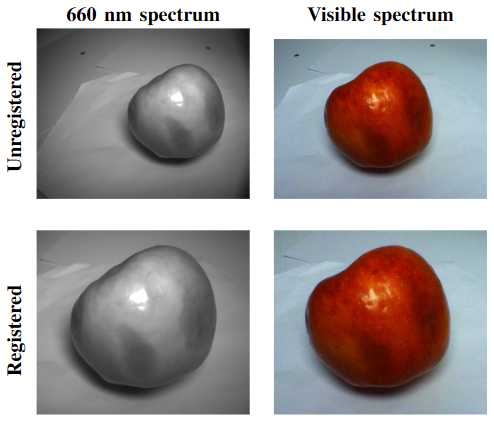

# Apple Defects Dataset

This repository contains the dataset used in the research article "Enhancing Apple’s Defect Classification: Insights from Visible Spectrum and Narrow Spectral Band Imaging", published in the International Conference on Pattern Recognition Systems (ICPRS) 2024. You can find the article [here](#).



## Dataset Structure
The dataset is available on this [link](https://shorturl.at/ELPRW) and its structured as follow:

```
.
├── train
│   ├── visible
│   │   ├── images
│   │   │   ├── rot
│   │   │   ├── bruise
│   │   │   └── spot
│   │   └── masks
│   │       ├── rot
│   │       ├── bruise
│   │       └── spot
│   └── 660nm
│       ├── images
│       │   ├── rot
│       │   ├── bruise
│       │   └── spot
│       └── masks
│           ├── rot
│           ├── bruise
│           └── spot
├── validation
│   ├── visible
│   │   ├── images
│   │   │   ├── rot
│   │   │   ├── bruise
│   │   │   └── spot
│   │   └── masks
│   │       ├── rot
│   │       ├── bruise
│   │       └── spot
│   └── 660nm
│       ├── images
│       │   ├── rot
│       │   ├── bruise
│       │   └── spot
│       └── masks
│           ├── rot
│           ├── bruise
│           └── spot
└── test
    ├── visible
    │   ├── images
    │   │   ├── rot
    │   │   ├── bruise
    │   │   └── spot
    │   └── masks
    │       ├── rot
    │       ├── bruise
    │       └── spot
    └── 660nm
        ├── images
        │   ├── rot
        │   ├── bruise
        │   └── spot
        └── masks
            ├── rot
            ├── bruise
            └── spot
```


## Citation
If you use this dataset in your research work, please cite the following article:
```bib
@inproceedings{author2024enhancing,
  title={Enhancing Apple’s Defect Classification: Insights from Visible Spectrum and Narrow Spectral Band Imaging},
  author={Author, A. and Coauthor, B.},
  booktitle={International Conference on Pattern Recognition Systems},
  year={2024}
}

```
**Note:**  If you encounter any issues with the provided link, please don't hesitate to contact us to update it. Proper attribution to the article is required if you utilize this dataset for your research.